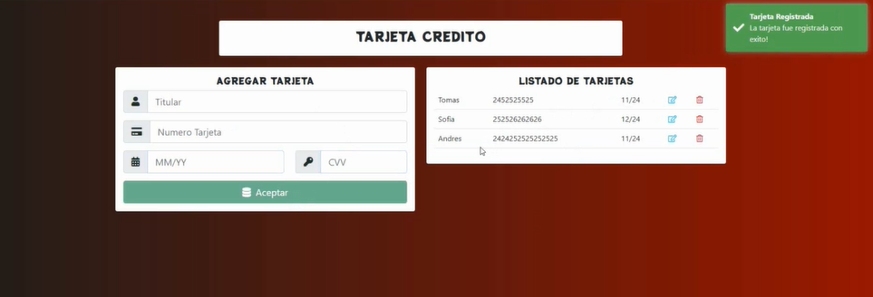
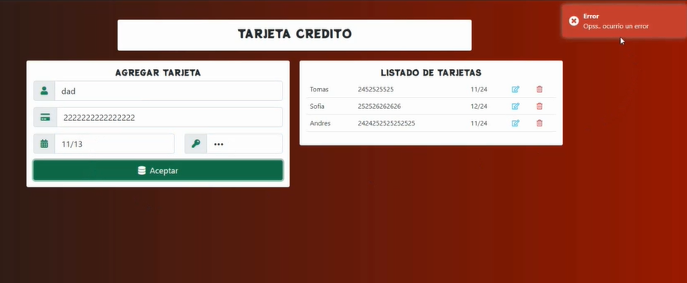

<h1 align="center"> I'M ARTIFICIAL INTELLIGENCE PROGRAMMER WITH PYTHON</h1>
<!-- 

  

-->
<!-- 
  
 -->
  

## 👨🏻‍💻 About Me:

 

- All about me is at **[My Website](https://jompy31.github.io/)**

## Description

Frontend development with Angular 9, NET Core 3 backend, Entity Framework Core 3, SQL Server + Deploy to Azure!

## Make it Your Own!

### 1. Make sure you have what you need
To build this website, you will need to have latest Node.js Software Development / Visual Studio Code/ cli.angular/ Bootstrap , downloaded and installed on your machine. If you don't already have it, you can get it <a href="https://nodejs.org/">Node_JS</a> / <a href="https://cli.angular.io/">CLI_Angular</a> / <a href="https://aka.ms/vscode/">VsCode</a> / <a href="https://getbootstrap.com/">Bootstrap</a>

## 2. Development server

Run `ng serve` for a dev server. Navigate to `http://localhost:4200/`. The app will automatically reload if you change any of the source files.

## 3. Code scaffolding

Run `ng generate component component-name` to generate a new component. You can also use `ng generate directive|pipe|service|class|guard|interface|enum|module`.

## 4. Build

Run `ng build` to build the project. The build artifacts will be stored in the `dist/` directory. Use the `--prod` flag for a production build.

## 5. Running unit tests

Run `ng test` to execute the unit tests via [Karma](https://karma-runner.github.io).

## 6. Running end-to-end tests

Run `ng e2e` to execute the end-to-end tests via [Protractor](http://www.protractortest.org/).

## 7. Further help

To get more help on the Angular CLI use `ng help` or go check out the [Angular CLI Overview and Command Reference](https://angular.io/cli) page.

## 🛠️ Technologies and Tools I use:

## ❤️ Let's get connected:

  
<!--   
 -->
  <!-- 
  
  
-->
  

# FETarjetaCredito

This project was generated with [Angular CLI](https://github.com/angular/angular-cli) version 11.2.3.

